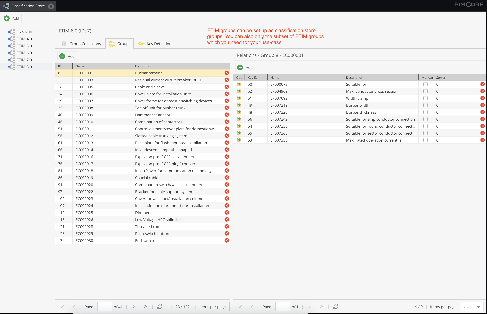
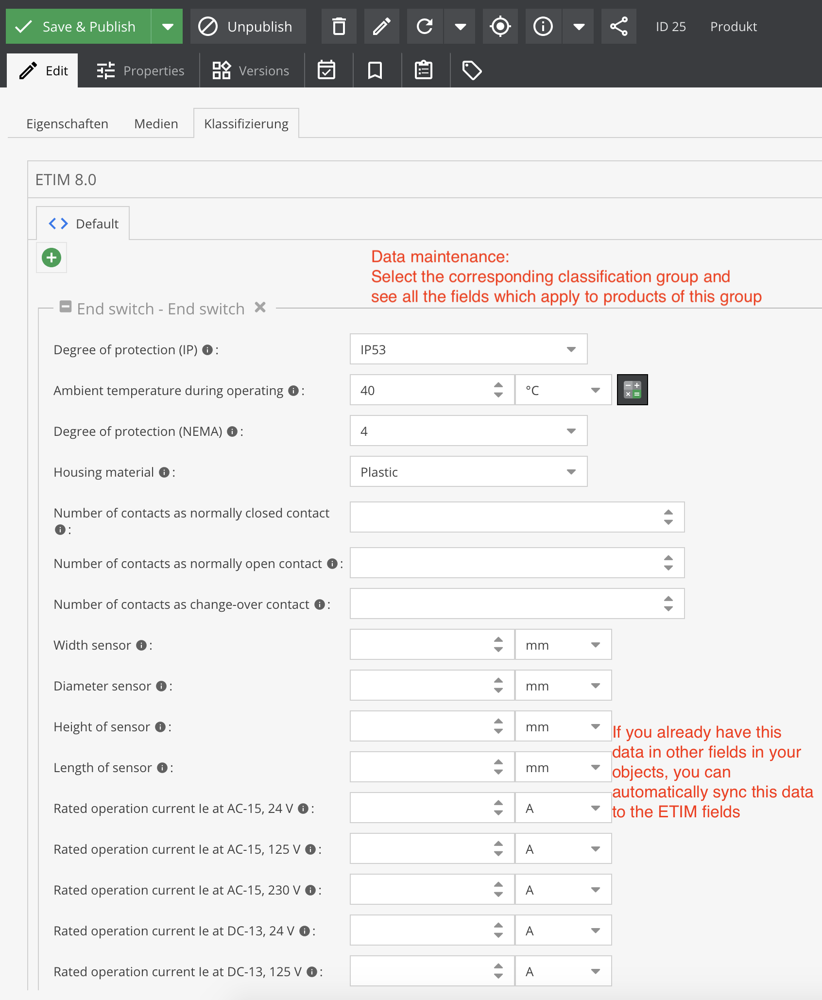

# BMEcat Export Add-on for Pimcore Data Director

This bundle adds a result callback function template to Data Director's attribute mapping to create BMEcat export feeds. 

As it uses Data Director's export capabilities, your BMEcat exports profit by:

* everything is configurable in Pimcore backend user interface - no creation of PHP files or anything similar necessary
* access any data which is connected to exported products, for example you can easily access assigned categories, price information, manufacturers, product features, images etc.
* full flexibility in setting up a transformation pipeline to change values to the desired format (e.g. some BMEcat-processing applications have restrictions on length of some fields)
* supported BMEcat versions: 1.2, 2005.1
* automatically execute exports whenever a product object gets saved whose data gets exported to:
    * prepare export once the data changes, so that the data does not have to be generated in the moment when the export is requested -> very fast exports because the export document is already available in the moment of request -> you will have an always up-to-date BMEcat export
    * upload exports automatically to a target system to always have up-to-date data there
    * automatically send data the other APIs
* intelligent checks whether anything changed since the last export. If nothing changed, export document gets delivered from cache
* access exports via URL, for example to pull BMEcat export into an external system instead of pushing it

## Importing ETIM classes / groups / features to Pimcore classification store

### Advantages of classification systems like ETIM

Using classification systems like ETIM has several advantages:

1. You do not have to reinvent which technical attributes products of certain categories have.
2. You simplify the process of providing your product data to resellsers and sales partners by exporting a product's category and technical data in the standardized ETIM format.

   For example if your sales partner buys products from multiple suppliers beside you, every manufacturer might invent its own system of categories and technical data attributes. The reseller how faces the challenge of putting all this data from the suppliers / manufacturers to its own category /
   attribute system. For example one supplier uses a category `Clothes > Shoes > For him` and another one uses `Clothes > Men > Shoes > Sneakers`. Now the supplier has to map those supplier categories to its own category system. ETIM simplifies this because it has standardized classes. As soon as a reseller has
   mapped the ETIM classes to his own category system, he can from now automatically assign supplier products to his own categories - so this mapping effort has only to be done once compared to once *per supplier* when not using a classification standard like ETIM.

   The same problems arise for technical data. One supplier has t-shirt sizes `M, L, XL, 2XL` while another one has `M, L, XL, XXL` and a third one has `Medium, Large, Extra Large, Extra-Extra large`. When a reseller wants to provide a size filter on its website he has to map these different sizes to
an own size system. But when the suppliers provide technical data as ETIM features, the whole mapping gets a lot easier because it only needs to be done once for all suppliers which support ETIM.

3. You can still keep your categories and technical data in other fields than a classification store because the Data Director bundle can be used to automatically copy the values from your fields to the classification store fields as soon as a product gets saved.

### ETIM import command

This bundle provides a command to automatically create and update Pimcore classification stores based on the [ETIM classification system](https://viewer.etim-international.com/). This import command can be triggered with
```shell
bin/console classification-store-import:etim
```
It will automatically create classification stores based on ETIM releases, group collections based on ETIM groups, groups based on ETIM classes and key definitions / fields based on ETIM features.

You can also filter the classes and fields to be created:
```shell
bin/console classification-store-import:etim EC004082 shoe
```
This will only import classes and fields which have anywhere in their names, descriptions etc. the term "EC004082" (ETIM class "shelf") or "shoe". It is better to filter by ETIM IDs because with words like "shoe" you will also import classes like "cable shoes".

All matching fields get updated with the current data from the ETIM API when you rerun the command again.

If you want to clear the corresponding classification stores before importing again, you can use the `--rm` flag:
```shell
bin/console classification-store-import:etim EC004082
```
This will search for the class "EC004082", truncate matching classification stores for all found ETIM releases and afterwards import the class and its fields.

---

After executing the `classification-store-import:etim` you will have a classification store with all the available fields, correct field types, available options, quantity value units (incl. conversion factors) and translations:





And in object editing you can enter the data:



## Installation
To use this plugin you have to first buy and install [Pimcore Data Director](https://pimcore.com/en/developers/marketplace/blackbit_digital_commerce/pimcore-data-director_e103850).

Please contact us to get access to the bundle's [Bitbucket repository](https://bitbucket.org/blackbitwerbung/pimcore-plugins-data-director-bmecat) or you get the plugin code as a zip file. 
When we permit your account to access our repository, please add the repository to the `composer.json` in your Pimcore root folder (see [Composer manual about repositories](https://getcomposer.org/doc/05-repositories.md#vcs)):
```json
"repositories": [
    {
        "type": "vcs",
        "url": "https://bitbucket.org/blackbitwerbung/pimcore-plugins-data-director-bmecat"
    }
],
```

Alternatively if you received the plugin code as zip file, please upload the zip file to your server (e.g. to the Pimcore root folder) and add the following to your `composer.json`:
```json
"repositories": [
    {
        "type": "artifact",
        "url": "path/to/directory/with/zip-file/"
    }
]
```

Then you should be able to execute `composer require blackbit/data-director-bmecat` (or `composer update blackbit/data-director-bmecat --with-dependencies` for updates if you already have this bundle installed) from CLI.

You can always access the latest version by executing `composer update blackbit/data-director-bmecat` on CLI.

## Setup export

Select `BMEcat Export` from the list of templates for the `Result Callback function` in data director's attribute mapping.

Then the fields which the BMEcat standard defines will appear as *virtual* fields in attribute mapping. To those fields you can map your data object class fields via drag & drop (and additional callback functions if necessary). Afterwards you can access the export either via manual export or via URL (via Data Director's REST API).